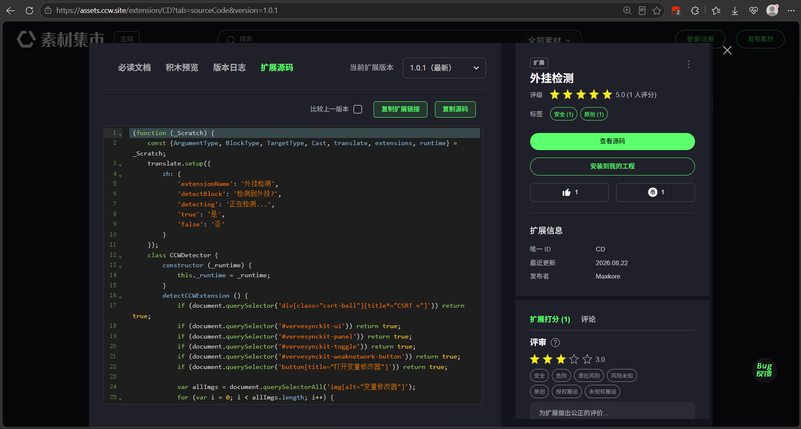
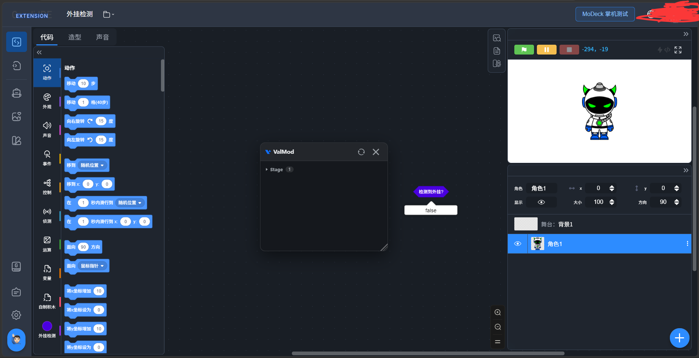

# VaIMod

Scratch变量操作面板
实时查看、修改并锁定角色变量。支持导入和导出配置模板。

## 未开智小学生试图使用ai检测VaIMod


这位ccw用户[Maxkore](https://www.ccw.site/student/670b895b19f4df62e8081d80)，qq号`3879473998`。试图使用ai做出检测VaIMod的拓展，可他不知道的是VaIMod的反侦察模块是整个项目中代码占比最多的🤣，开发者现已更新并进一步加强反侦察模块。
## 👇其实最初版本的VaIMod反侦察模块就足以让这个垃圾拓展识别不到👇


## 使用

1. 安装浏览器脚本管理器（如 [Tampermonkey](https://www.tampermonkey.net/)）
2. 安装脚本：[https://VaIMod.github.io/VaIMod/VaIMod.user.js](https://VaIMod.github.io/VaIMod/VaIMod.user.js)（或本地 `dist/VaIMod.user.js`）
3. 项目页面：[https://VaIMod.github.io/VaIMod/](https://VaIMod.github.io/VaIMod/)

## 架构

- **Svelte 5 + Vite**：UI 框架与构建工具
- **`src/core`**：核心 SDK，负责ScratchVM
- **`src/ui`**：UI 层（Svelte 组件）

## 开发

```bash
npm install   # 安装依赖
npm run dev   # 开发模式
npm run build # 构建脚本
```

## 免责声明

本工具仅供个人学习研究使用，禁止用于非法获利。使用产生的一切版权纠纷、法律责任均由使用者自行承担，与工具制作者无关。请尊重创作者知识产权。

## License

本项目使用 [Apache License 2.0](https://www.apache.org/licenses/LICENSE-2.0) 开源许可，完整协议见 [LICENSE](LICENSE)。

 可自由使用、修改、二次分发，需保留原版权声明，标注原作者，按「现状」提供，不附带任何担保

